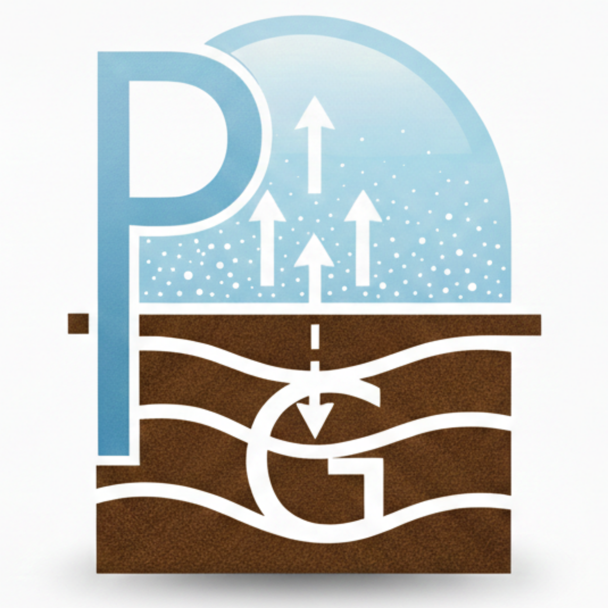
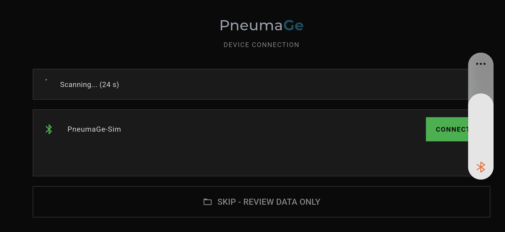
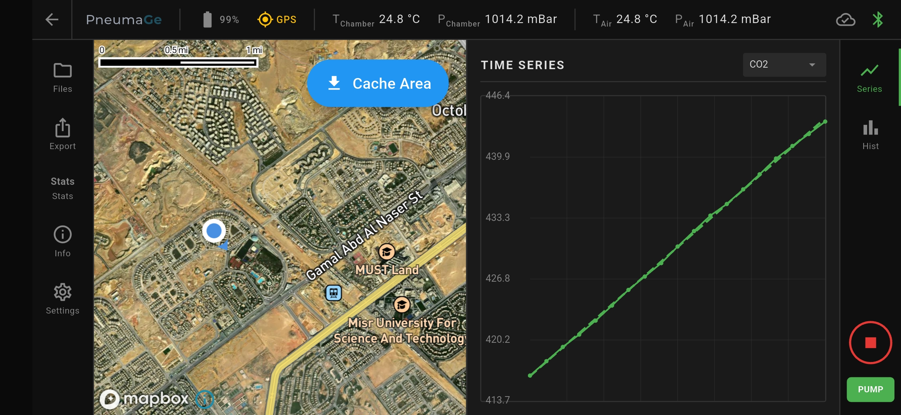
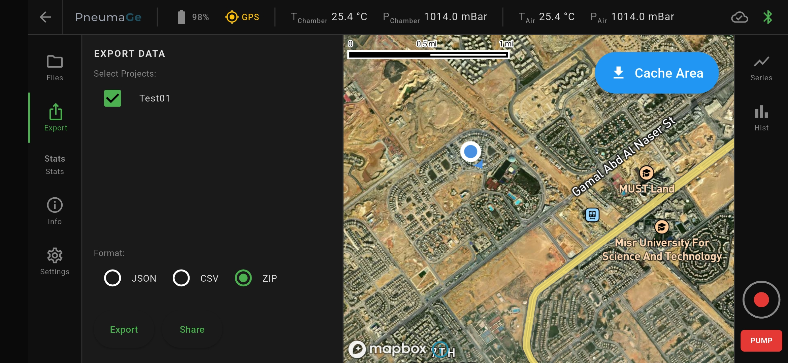

# PneumaGe App

<p align="center">
  
</p>

A Flutter mobile application for researchers and scientists to measure soil-gas emissions and estimate flux using an accumulation chamber device connected via Bluetooth Low Energy.

## Screenshots

<p align="center">
  
  
  
</p>

## Project Status

### ✅ Implemented
- **State Management**: Riverpod architecture for global app state
  - Flutter Riverpod 2.6.1 integration
  - Provider-based dependency injection (no manual service instantiation)
  - Automatic lifecycle management (services disposed when app closes)
  - Reactive UI updates via `ref.watch()` (no manual StreamSubscriptions)
  - Navigation-safe: no dispose() errors during screen transitions
- **BLE Service**: Complete Bluetooth Low Energy communication service
  - Device scanning and connection management
  - Binary protocol parsers for all characteristics
  - MTU negotiation (247 bytes achieved on typical devices)
  - Chunked notification pattern for large data transfers (device info: 937 bytes)
  - Automatic heartbeat mechanism (15s interval, fire-and-forget pattern)
  - Real-time data streams (CO2, battery, chamber stats, system status)
  - Robust error handling and connection cleanup
  - StreamController lifecycle management (prevents post-disposal exceptions)
- **Data Service**: Repository pattern for data ownership and stream management
  - Separates BLE transport layer from data ownership
  - Caches all sensor values (battery, chamber temp/pressure/humidity, connection state)
  - Re-broadcasts BLE streams for UI consumption
  - Provides instant access via getters (no async delays)
  - Proper lifecycle with clear() and dispose() methods
- **GPS Service**: Location tracking and quality monitoring
  - Real-time GPS position updates using geolocator package
  - Reactive GPS state monitoring - automatically starts/stops when GPS is enabled/disabled
  - Accuracy-based quality indicator (0-3): Excellent/Good/Fair/Poor
  - Automatic permission management (iOS/Android)
  - Streams position, quality, and enabled state via Riverpod providers
  - GPS indicator: gray when disabled, color-coded when enabled (green/amber/orange/red by accuracy)
- **Device Info Streaming**: Large JSON descriptor transfer via BLE notifications
  - Arduino streams device info in 20-byte chunks with 15ms delay
  - App uses `onValueReceived` stream to capture all packets without drops
  - Auto-detection of complete JSON (937 characters)
  - Device info cached in DataService and available immediately after connection
- **Branding**: PneumaGe logo implementation
  - Reusable `PneumageLogo` widget with Montserrat font (Google Fonts)
  - Two-tone color scheme: "Pneuma" (#9CA3AF, weight 500) + "Ge" (#1F4E5F, weight 700)
  - Size variants (large 24px, small 12px) with optional glow effects
  - Logo displayed in status bar (top-left corner)
- **Scan/Connect Screen**: Device discovery and connection UI
  - Auto-scanning with 30-second timeout
  - Bluetooth state monitoring with user guidance
  - Device list with connection controls
  - Error handling and retry mechanisms
  - Device info validation with 5-second timeout
- **Home Screen**: Main application interface
  - Live status bar with real-time sensor data (battery, GPS, chamber/air temp/pressure, BLE status)
  - All status bar indicators fully wired via Riverpod providers
  - Back navigation with disconnect handling
  - Panel system (Files, Stats, Info, Settings, Time Series, Histogram)
- **Info Panel**: Device information display (fully wired)
  - Shows device name, sensor info, processor info, firmware version
  - Reads from DataService with proper null safety
  - Updates immediately after connection
- **Settings Service**: Complete settings persistence and management
  - SettingsService with load/save for app and device settings
  - App settings: units preference (Metric/Imperial)
  - Device settings: pump speed (LOW/MEDIUM/HIGH), channel visibility
  - Settings panel with tabbed interface (App/Device tabs)
  - Per-device settings persist using device ID as key
  - Settings providers for reactive access across the app
- **Pump Control**: Fully integrated pump button with BLE commands ✅ COMPLETE
  - UI toggle button in right sidebar (green=on, red=off)
  - Reads pump speed setting (LOW/MEDIUM/HIGH) from device settings
  - Sends appropriate BLE command (0x10/0x11/0x12) when enabled
  - Sends stop command (0x00) when disabled
  - Error handling with user feedback via snackbar
  - Settings adjustable in Settings panel → Device tab
- **Project Management**: Complete local storage and UI integration ✅ COMPLETE
  - ProjectService with JSON-based local storage (projects.json + individual measurement files)
  - Project providers for reactive state management (projectsProvider, currentProjectProvider, projectsNotifierProvider)
  - Current project selection persisted via SharedPreferences
  - Files Panel fully wired to real data (removed placeholder projects)
  - Visual feedback for active project: green dot + [ACTIVE] badge + bold text
  - Inline project creation form (solves mobile keyboard obstruction)
  - Separate tap targets: project name sets active, arrow expands/collapses
  - Files Panel sized at 50% of center area
  - Record button guard: prevents recording without active project, auto-opens Files Panel
- **Recording System**: Complete data recording workflow ✅ COMPLETE
  - Record button wired to BLE START_MEASUREMENT (0x01) and STOP_ALL (0x00) commands
  - Automatic pump control: starts pump at configured speed when recording begins
  - 1Hz sample collection from all sensors (CO2, battery, chamber temp/pressure/humidity)
  - GPS buffer integration: 30-second window with median position calculation
  - GPS fallback strategy: buffer median → current position → 0.0/0.0 (prioritizes data over location)
  - Per-project file counter: generates filenames like PG_001, PG_002, etc.
  - Guard dialogs: prevents accidental stop during recording (Record stop + Pump toggle)
  - User feedback: GPS quality status shown after recording (excellent/good/fair/poor/unavailable)
  - Files Panel auto-refresh: measurements appear immediately after recording stops
- **Export System**: Multi-project data export with OS sharing ✅ COMPLETE
  - Export Panel UI: project selection with checkboxes, format picker (JSON/CSV/ZIP)
  - Multi-project support: export multiple projects in one operation
  - Format options: JSON (array of projects), CSV (concatenated with headers), ZIP (project archive)
  - File naming: `pneumage_export_{timestamp}.zip` (e.g., pneumage_export_20260218_143052.zip)
  - Download location: Downloads folder by default (Android external storage, iOS documents)
  - Archived project handling: placeholder with TODOs for cloud fetch (backend not ready)
  - Share integration: uses OS share sheet via share_plus package
  - Export service: complete implementation with JSON/CSV/ZIP support via archive package
  - Real data integration: wired to projectsProvider and ProjectService
- **Data Models**: Complete data structures for User, Project, Measurement, Sample, DeviceInfo, etc.
- **Services**: Project local storage, settings persistence, data export (JSON/CSV/ZIP), Firebase sync (implemented)
- **Platform Configuration**: Landscape-only mode (enforced at all levels), immersive fullscreen, landscape splash screen, BLE + Location permissions (iOS/Android)

### 🚧 In Progress
- Real-time time series and histogram plotting

### 📋 To Do
- Map integration for measurement locations
- Device descriptor caching strategy
- Additional statistics calculations

## Getting Started

### Prerequisites
- Flutter 3.38.3 or higher
- Dart 3.10.1 or higher
- Physical Android or iOS device (BLE does not work in simulators)
- Arduino Nano BLE Sense Rev 2 with PneumaGe firmware

### Installation
1. Clone the repository
2. Install dependencies:
   ```bash
   flutter pub get
   ```
3. Run the app on a connected device:
   ```bash
   flutter run
   ```

### Testing with Arduino Firmware

#### Setup
1. Upload the PneumaGe firmware to your Arduino Nano BLE Sense Rev 2
2. Set `SIMULATE_PERIPHERALS = true` in the firmware for testing without physical sensors
3. Open Arduino IDE Serial Monitor (9600 baud) to observe device logs
4. Launch the Flutter app on a physical device

#### Expected Behavior

**1. App Launch → Scan Screen**
- App opens in landscape mode
- "PNEUMAGE - DEVICE CONNECTION" header appears
- Scanning automatically starts (30-second countdown visible)
- "Scanning... (30 s)" shown with a spinner

**2. Device Discovery**
- Within a few seconds, Arduino appears as **"PneumaGe-Sim"**
- Green Bluetooth icon and "CONNECT" button next to device name
- Multiple Arduinos will all appear if in range

**3. Connection Process**
- Tap "CONNECT" on your device
- Loading modal appears: "Connecting to PneumaGe-Sim..."
- Connection takes 2-5 seconds typically

**4. Home Screen Loads**
- Modal closes, home screen appears
- **Status bar shows:**
  - **PneumaGe Logo**: Two-tone branding (top-left)
  - **Battery**: ~100% (simulated, slowly draining)
  - **T_Chamber**: ~25°C (simulated, slightly varying)
  - **P_Chamber**: ~1013 mBar (simulated)
  - **Bluetooth icon**: Green (connected)
- Left/right sidebars with panel icons visible
- Back arrow button in top-left corner

**5. Real-time Updates**
- Status bar values update every ~1 second
- Battery percentage decreases slowly (faster when pump is on)
- Temperature and pressure vary slightly (simulated environmental changes)

**6. Arduino Serial Monitor Output**
```
PneumaGe Firmware Booting...
IMU level baseline calibrated.
Setup complete. Advertising...
Client connected.
Streaming Device Info... Total size: 937
Device Info stream complete.
[BLE CMD] Received: 0xAA
[HEARTBEAT] System recovered.
[BLE CMD] Received: 0xAA
...
```
- Device info streams in ~47 chunks (20 bytes each, 15ms delay)
- Heartbeat (0xAA) appears every 15 seconds
- LED on Arduino blinks while connected

**7. Disconnect**
- Tap back arrow in home screen
- Returns to scan/connect screen
- Serial Monitor shows: "Client disconnected. Resetting state."
- Arduino LED goes solid

#### Testing Checklist

✅ **Basic Connection**
- [ ] Device appears in scan results as "PneumaGe-Sim"
- [ ] Connection succeeds within 5 seconds
- [ ] Device info loads (check Serial Monitor for JSON)
- [ ] Home screen appears

✅ **Data Streaming**
- [ ] PneumaGe logo visible in top-left of status bar
- [ ] Battery shows ~100%
- [ ] Temperature shows ~25°C
- [ ] Pressure shows ~1013 mBar
- [ ] Bluetooth icon is green
- [ ] Values update every second

✅ **Heartbeat**
- [ ] Arduino Serial Monitor shows "Received: 0xAA" every 15s
- [ ] No timeout messages appear while connected
- [ ] LED blinks steadily

✅ **Disconnection**
- [ ] Back button returns to scan screen
- [ ] Arduino Serial Monitor shows "Client disconnected"
- [ ] LED goes solid
- [ ] Can reconnect successfully

#### Troubleshooting

**Device Not Found**
- Ensure Arduino is powered and firmware uploaded
- Grant Bluetooth permissions in phone settings
- Check Serial Monitor shows "Advertising..."
- Restart Arduino and tap "RESCAN"

**Connection Fails**
- Move phone closer to Arduino (< 5m)
- Restart both Arduino and app
- Check Serial Monitor for initialization errors
- Ensure no other device is connected to the Arduino

**Status Bar Shows Zeros**
- Verify LED is blinking (indicates connected state)
- Check Serial Monitor for errors or warnings
- Reconnect and observe Serial Monitor output

**Heartbeat Timeout After 30s**
- This indicates the safety feature is working
- Serial Monitor will show: "[HEARTBEAT] Timeout: System auto-shutdown"
- This protects the experiment if the app crashes
- Normal operation shows heartbeat every 15s

## Architecture

### State Management: Riverpod
The app uses **Flutter Riverpod** for dependency injection and reactive state management:

- **Global Providers**: Services live at app level as singleton providers
  - `bleServiceProvider`: BLE transport layer
  - `dataServiceProvider`: Data ownership layer
  - `connectionStateProvider`: Real-time connection state
  - `chamberStatsProvider`, `batteryLevelProvider`, etc.
- **Automatic Lifecycle**: Providers manage service disposal (via `ref.onDispose`)
- **Reactive UI**: Widgets use `ref.watch()` for automatic rebuilds on state changes
- **No Manual Subscriptions**: Eliminates boilerplate (no initState, dispose, setState)
- **Navigation Safe**: No `ref` usage in dispose() methods prevents StateError

### Design Pattern: Repository Pattern
- **Repository Pattern**: Clean separation of concerns
  - `BleService`: Transport layer only (Bluetooth communication)
  - `DataService`: Data ownership layer (caching, re-broadcasting)
  - UI widgets: Data consumers (via Riverpod providers)
- **Stream Management**: Lifecycle-safe StreamControllers with isClosed checks
- **Heartbeat Timer**: Fire-and-forget pattern with guard flag prevents overlapping sends

### Technology Stack
- **Framework**: Flutter 3.38.3 (stable), Dart 3.10.1
- **State Management**: flutter_riverpod ^2.6.1
- **BLE Communication**: flutter_blue_plus ^2.1.1
- **Location Services**: geolocator ^13.0.4
- **Local Storage**: path_provider, shared_preferences
- **Cloud Backend**: Firebase (Firestore, Cloud Storage, Auth)
- **Data Export**: JSON, CSV, ZIP (via archive package)
- **Platform**: Android, iOS (landscape-only, immersive fullscreen)

### Project Structure
```
lib/
├── main.dart                      # App entry point, ProviderScope wrapper
├── theme/app_theme.dart           # Dark theme, colors, typography
├── providers/                     # ✅ Riverpod providers
│   ├── ble_provider.dart         # BLE service & connection state providers
│   ├── data_provider.dart        # Data service & sensor stream providers
│   ├── gps_provider.dart         # GPS service & location stream providers
│   ├── settings_provider.dart    # Settings service & device settings providers
│   └── project_provider.dart     # Project service & project state providers
├── models/                        # Data models
│   ├── device.dart               # DeviceInfo, SensorInfo, ChannelDefinition, PumpInfo
│   ├── measurement.dart          # Measurement, Sample, GpsLocation
│   ├── project.dart              # Project, SyncStatus
│   ├── user.dart                 # User
│   ├── app_settings.dart         # AppSettings (units)
│   ├── device_settings.dart      # DeviceSettings (pump speed LOW/MEDIUM/HIGH, channel visibility)
│   └── panel_state.dart          # UI panel state enums
├── services/
│   ├── ble_service.dart          # ✅ Bluetooth transport layer (COMPLETE)
│   ├── data_service.dart         # ✅ Data ownership & stream re-broadcasting (COMPLETE)
│   ├── gps_service.dart          # ✅ GPS location tracking & quality monitoring (COMPLETE)
│   ├── settings_service.dart     # ✅ Local persistence (SharedPrefs + JSON) (COMPLETE)
│   ├── project_service.dart      # ✅ Project & measurement local storage (COMPLETE)
│   ├── sync_service.dart         # Firebase sync/archive/restore
│   └── export_service.dart       # JSON/CSV/ZIP export
├── screens/
│   ├── scan_connect_screen.dart  # ✅ Device scanning and connection (ConsumerStatefulWidget)
│   └── home_screen.dart          # Main UI with panels and sidebars (ConsumerStatefulWidget)
└── widgets/
    ├── status_bar.dart           # ✅ Live sensor data via Riverpod (ConsumerWidget)
    ├── pneumage_logo.dart        # ✅ Reusable branding widget (COMPLETE)
    ├── left_sidebar.dart         # Navigation icons
    ├── right_sidebar.dart        # Control buttons
    └── panels/
        ├── info_panel.dart       # ✅ Device information via Riverpod (ConsumerWidget)
        ├── stats_panel.dart      # Live statistics
        ├── files_panel.dart      # ✅ Project management with inline form (ConsumerStatefulWidget)
        ├── time_series_panel.dart # Real-time plot
        ├── histogram_panel.dart  # Distribution plot
        ├── settings_panel.dart   # ✅ App/device settings with reactive updates (ConsumerWidget)
        └── export_panel_demo.dart # Data export UI
```

## Bluetooth Protocol

The app communicates with the Arduino device using 7 BLE characteristics:

### Characteristics
1. **Gas Concentration** (0x19B10001): 4-byte float, notifies every 1s (CO2 in ppm)
2. **Chamber Stats** (0x19B10002): 10-byte packed struct, notifies every 1s
   - Temperature (°C × 100, int16)
   - Pressure (hPa × 1000, uint32)
   - Humidity (% × 100, uint16)
   - Status bitmask (uint16)
3. **System Command** (0x19B10003): Single-byte write
   - 0x00: Stop all
   - 0x01: Start measurement
   - 0x10/11/12: Pump low/med/high
   - 0x20: Tare gas sensor
   - 0x30: Set level baseline
   - 0xAA: Heartbeat (automatic, every 15s)
4. **System Status** (0x19B10005): Single-byte notify (0x00=OK, 0x01=tilt, 0x02=bump, 0x07=timeout)
5. **Battery Life** (0x19B10006): 4-byte float, notifies every 1s (SoC %)
6. **Device Info** (0x19B10007): JSON document, read once on connection

### Heartbeat Mechanism
The app automatically sends a heartbeat command (0xAA) every 15 seconds to prevent the 30-second timeout on the Arduino. If the connection is lost, the device automatically stops the pump and measurement.

## Design Language
- **Reference**: ASIAir astrophotography app
- **Theme**: Dark (#0A0A0A background), minimal color palette
- **Typography**: RobotoMono (monospace) throughout
- **Colors**: Green (#4CAF50) for connected/active, Red (#E53935) for danger/disconnected
- **Style**: Flat, angular, utilitarian — no rounded elements

## User Flow
1. **App Launch** → Scan/Connect Screen (auto-scanning for 30s)
2. **Device Found** → Connect button appears
3. **Tap Connect** → Loading modal → Home Screen (on success)
4. **Connected** → Status bar shows live CO2, battery, temp, pressure, etc.
5. **Press Back Arrow** → Disconnect and return to Scan Screen

## Data Model
- **Local-first architecture**: Raw sample data is the source of truth
- **Optional cloud sync**: Firebase for metadata and bulk storage
- **Derived values**: Flux, R², slope computed on-demand (never stored)
- **Hierarchy**: User → Projects → Measurements → Samples → Channel Values

## License

PneumaGe is open-source software licensed under the [Apache License 2.0](LICENSE).

**What this means:**
- ✅ Free to use for research, commercial, and personal projects
- ✅ Modify and distribute as you see fit
- ✅ Patent protection included
- ✅ No warranty or liability (use at your own risk)

**Copyright 2026 PneumaGe Contributors**

## Contributing

We welcome contributions from the scientific and developer communities! PneumaGe is designed for measuring gas flux in environmental research, and we'd love your input to make it better.

**Ways to contribute:**
- Report bugs and suggest features via GitHub Issues
- Submit pull requests for bug fixes or enhancements
- Improve documentation
- Share your research use cases

See [CONTRIBUTING.md](CONTRIBUTING.md) for detailed guidelines.

## Citation

If you use PneumaGe in your research, please cite:
```
PneumaGe: Open-Source Gas Flux Measurement Software
https://github.com/PneumaGe/pneuma-flow
```
